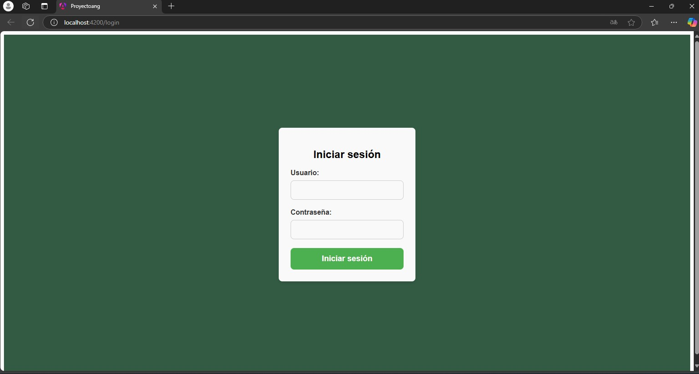
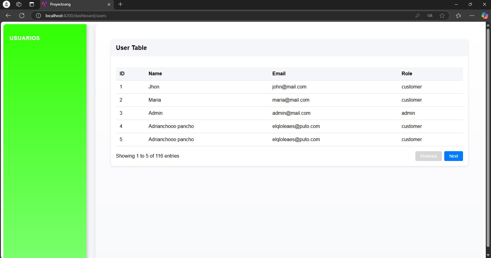

# Integracion de una API con Angular
Este proyecto de Angular 18.2 está diseñado para consumir una API de usuarios y proporcionar un sistema de autenticación mediante un formulario de inicio de sesión.

## Caracteristicas
Inicio de Sesión: Autenticación de usuarios mediante credenciales.
Consumo de API: Obtención de datos de usuario desde una API


## Link de la Api

#### Get all items

```https:
https//api.escuelajs.co/api/v1/users
```
## Pantalla de Login


## Dasboard con Usuarios


## Ejecucion de la aplicacion de manera local

Clona el repositorio

```bash
  https://github.com/Ferchox45/PrograWebLFCH-main.git
```

Vamos a la carpeta del proyecto

```bash
  cd PrograWebLFCH-main
```

Instalamos dependencias

```bash
  npm install
```

Corremos el servidor de manera loca

```bash
  ng serve
```
Puedes ocupar cualquieras de las credenciales de la API, por ejemplo:

```bash
  usuario: Jhon
  password: changeme
```


## Licencia


